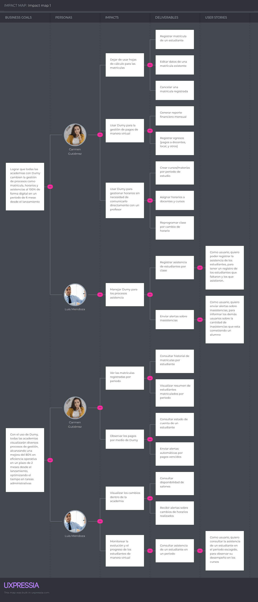

<h1 style="text-align: center;"> Informe TB1 </h1>
<h3 style="text-align: center;"> Universidad Peruana de Ciencias Aplicadas </h3>

<h5 style="text-align: center"> Ingeniería de Software </h5>

<h5 style="text-align: center"> 1ASI0729 - Desarrollo de Aplicaciones Open Source </h5>

<h5 style="text-align: center"> Seccíón: 4304  </h5>

<h5 style="text-align: center"> Docente: Efraín Ricardo Bautista Ubillús </h5>

<h5 style="text-align: center"> Startup: SmartEdu </h5>

<h5 style="text-align: center"> Producto: Demy </h5>

<h2>Team members:</h2>

| Código     | Nombre                             |
|------------|------------------------------------|
| U20221G120 | Crispin Ramos, Daniel Franco       |
| U202312318 | Dominguez Vargas, Rafael Alexander |
| U20201E843 | Ramirez Mestanza, Salim Ignacio    |
| U20221C486 | Sulca Gonzales, Paúl Fernando      |
| U20231A778 | Vilca Saboya, Diego Alejandro      |

<h5 style="text-align: center"> Ciclo 2025-01 </h5>

# Registro de Versiones del Informe

# Project Collaboration Insights

URL de nuestro repositorio para el reporte del proyecto: **[link del landing page]**

**TB1**
 Para el desarrollo del TB1 cada participantes del equipo realizo las siguientes tareas:

| Integrantes                         | Tarea Asignada                                                                                                                                                                 |
|-------------------------------------|--------------------------------------------------------------------------------------------------------------------------------------------------------------------------------|
| Crispin Ramos, Daniel Franco        | - Startup Profile - Perfiles del equipo - Empathy Mapping - Ubiquitous Language - Diseño, ejecución y análisis de una entrevista - To-Be Scenario Mapping - General Style Guidelines - Searching Systems -Web Applications Wireframes - Web Applications Wireflow Diagramas - Landing Page(Contact + Footer) - Environment Configuration - Source Code Management)                                   |
| Dominguez Vargas, Rafael Alexander  | - Project Report Collaboration Insights - Segmentos objetivo - User Task Matrix - Diseño, ejecución y análisis de una entrevista - Impact Mapping - Organization Systems - Landing Page Wireframes - Web applications Mock-ups - Web Application User Flow Diagrams - Landing Page(testimonials + About us) - Development Evidence - Execution Evidence - Deployment Evidence - Team Collaboration Insights|
| Ramirez Mestanza, Salim Ignacio     | - Registro de Versiones del Informe - Lean UX Process completo (4 partes) - User Personas - Diseño, ejecución y análisis de una entrevista - Product Backlog - SEO Tags and Meta Tags - Web Applications Prototyping - Class Diagrams - Class Dictionary - Database Diagram - Landing Page (Navbar + Hero + i18n)|
| Sulca Gonzales, Paúl Ferdando       | - Antecedentes y problemática - As-is Scenario Mapping - Diseño, ejecución y análisis de una entrevista - Product Backlog - Labeling Systems - Landing Page Mock-up - Web Applications Wireframes - Web Applications Prototyping - Software Architecture Context Diagram - Software Architecture Container Diagrams - Software Architecture Container Diagrams - Software Architecture Components Diagrams - Database Diagram - Landing Page (Planes y precios + preguntas frecuentes)|
| Vilca Saboya, Diego Alejandro       | - Carátula - Tabla de contenidos - Student outcome - Análisis competitivo y estrategias - User Journey Mapping - Diseño, ejecución y análisis de una entrevista - User Stories - Web Style Guidelines - Navigation Systems - Web Applications Mock-ups - Landing Page (About the product + Beneficios y características) - Style Guide & Conventions - Deployment Configuration - Sprint Planning - Aspect Leaders and Collaborators - Sprint Backlog|

**Github Collaboration Insights**

En github se presenta un timeline de las ramas principales realizadas por cada integrante del equipo y procesos merge sometidos. Todas las ramas fueron creadas tomando en cuenta el diseño del **GitFlow** para una organizacion que usa un software control de versiones.

Los Integrantes son:

| Integrantes                          | Nombre en GitHub |
|--------------------------------------|------------------|
| Crispin Ramos, Daniel Franco         | danielcr04       |
| Dominguez Vargas, Rafael Alexander   | Radv2005         |
| Ramirez Mestanza, Salim Ignacio      | salimramirez     |
| Sulca Gonzales, Paúl Ferdando        | Kyrubi           |
| Vilca Saboya, Diego Alejandro        | diegovilcasaboya |

Las ramas mas prominentes:
- **main:** 
- **develop:** 
- **feature-product-design:** 
- **feature-sprint1:** 

[Network graph]

A continuación se presentan los gráficos que muestran el análisis de los commits en el repositorio del informe. En estos gráficos se detalla la cantidad de líneas de código añadidas por cada miembro del equipo.

**TB1**

[COMMITS]

# Contenido

- [Capítulo I: Introducción](#capítulo-i-introducción)
    - [1.1. Startup Profile](#11-startup-profile)
        - [1.1.1. Descripción de la Startup](#111-descripción-de-la-startup)
        - [1.1.2. Perfiles de los integrantes del equipo](#112-perfiles-de-los-integrantes-del-equipo)
    - [1.2. Solution Profile](#12-solution-profile)
        - [1.2.1. Antecedentes y problemática](#121-antecedentes-y-problemática)
        - [1.2.2. Lean UX Process](#122-lean-ux-process)
            - [1.2.2.1. Lean UX Problem Statements](#1221-lean-ux-problem-statements)
            - [1.2.2.2. Lean UX Assumptions](#1222-lean-ux-assumptions)
            - [1.2.2.3. Lean UX Hypothesis](#1223-lean-ux-hypothesis)
            - [1.2.2.4. Lean UX Canvas](#1224-lean-ux-canvas)
    - [1.3. Segmentos objetivo](#13-segmentos-objetivo)

- [Capítulo II: Requirements Elicitation & Analysis](#capítulo-ii-requirements-elicitation--analysis)
    - [2.1. Competidores](#21-competidores)
        - [2.1.1. Análisis competitivo](#211-análisis-competitivo)
        - [2.1.2. Estrategias y tácticas frente a competidores](#212-estrategias-y-tácticas-frente-a-competidores)
    - [2.2. Entrevistas](#22-entrevistas)
        - [2.2.1. Diseño de entrevistas](#221-diseño-de-entrevistas)
        - [2.2.2. Registro de entrevistas](#222-registro-de-entrevistas)
        - [2.2.3. Análisis de entrevistas](#223-análisis-de-entrevistas)
    - [2.3. Needfinding](#23-needfinding)
        - [2.3.1. User Personas](#231-user-personas)
        - [2.3.2. User Task Matrix](#232-user-task-matrix)
        - [2.3.3. User Journey Mapping](#233-user-journey-mapping)
        - [2.3.4. Empathy Mapping](#234-empathy-mapping)
        - [2.3.5. As-is Scenario Mapping](#235-as-is-scenario-mapping)
    - [2.4. Ubiquitous Language](#24-ubiquitous-language)

- [Capítulo III: Requirements Specification](#capítulo-iii-requirements-specification)
    - [3.1. To-Be Scenario Mapping](#31-to-be-scenario-mapping)
    - [3.2. User Stories](#32-user-stories)
    - [3.3. Impact Mapping](#33-impact-mapping)
    - [3.4. Product Backlog](#34-product-backlog)

- [Capítulo IV: Product Design](#capítulo-iv-product-design)
    - [4.1. Style Guidelines](#41-style-guidelines)
        - [4.1.1. General Style Guidelines](#411-general-style-guidelines)
        - [4.1.2. Web Style Guidelines](#412-web-style-guidelines)
    - [4.2. Information Architecture](#42-information-architecture)
        - [4.2.1. Organization Systems](#421-organization-systems)
        - [4.2.2. Labeling Systems](#422-labeling-systems)
        - [4.2.3. SEO Tags and Meta Tags](#423-seo-tags-and-meta-tags)
        - [4.2.4. Searching Systems](#424-searching-systems)
        - [4.2.5. Navigation Systems](#425-navigation-systems)
    - [4.3. Landing Page UI Design](#43-landing-page-ui-design)
        - [4.3.1. Landing Page Wireframe](#431-landing-page-wireframe)
        - [4.3.2. Landing Page Mock-up](#432-landing-page-mock-up)
    - [4.4. Web Applications UX/UI Design](#44-web-applications-uxui-design)
        - [4.4.1. Web Applications Wireframes](#441-web-applications-wireframes)
        - [4.4.2. Web Applications Wireflow Diagrams](#442-web-applications-wireflow-diagrams)
        - [4.4.3. Web Applications Mock-ups](#443-web-applications-mock-ups)
        - [4.4.4. Web Applications User Flow Diagrams](#444-web-applications-user-flow-diagrams)
    - [4.5. Web Applications Prototyping](#45-web-applications-prototyping)
    - [4.6. Domain-Driven Software Architecture](#46-domain-driven-software-architecture)
        - [4.6.1. Software Architecture Context Diagram](#461-software-architecture-context-diagram)
        - [4.6.2. Software Architecture Container Diagrams](#462-software-architecture-container-diagrams)
        - [4.6.3. Software Architecture Components Diagrams](#463-software-architecture-components-diagrams)
    - [4.7. Software Object-Oriented Design](#47-software-object-oriented-design)
        - [4.7.1. Class Diagrams](#471-class-diagrams)
        - [4.7.2. Class Dictionary](#472-class-dictionary)
    - [4.8. Database Design](#48-database-design)
        - [4.8.1. Database Diagram](#481-database-diagram)

- [Capítulo V: Product Implementation, Validation & Deployment](#capítulo-v-product-implementation-validation--deployment)
    - [5.1. Software Configuration Management](#51-software-configuration-management)
        - [5.1.1. Software Development Environment Configuration](#511-software-development-environment-configuration)
        - [5.1.2. Source Code Management](#512-source-code-management)
        - [5.1.3. Source Code Style Guide & Conventions](#513-source-code-style-guide--conventions)
        - [5.1.4. Software Deployment Configuration](#514-software-deployment-configuration)
    - [5.2. Landing Page, Services & Applications Implementation](#52-landing-page-services--applications-implementation)
        - [5.2.1. Sprint 1](#521-sprint-1)
            - [5.2.1.1. Sprint Planning 1](#5211-sprint-planning-1)
            - [5.2.1.2. Sprint Backlog 1](#5212-sprint-backlog-1)
            - [5.2.1.3. Development Evidence for Sprint Review](#5213-development-evidence-for-sprint-review)
            - [5.2.1.4. Testing Suite Evidence for Sprint Review](#5214-testing-suite-evidence-for-sprint-review)
            - [5.2.1.5. Execution Evidence for Sprint Review](#5215-execution-evidence-for-sprint-review)
            - [5.2.1.6. Services Documentation Evidence for Sprint Review](#5216-services-documentation-evidence-for-sprint-review)
            - [5.2.1.7. Software Deployment Evidence for Sprint Review](#5217-software-deployment-evidence-for-sprint-review)
            - [5.2.1.8. Team Collaboration Insights during Sprint](#5218-team-collaboration-insights-during-sprint)

- [Conclusiones](#conclusiones)
    - [Conclusiones y recomendaciones](#conclusiones-y-recomendaciones)
    - [Video About-the-Team](#video-about-the-team)
- [Bibliografía](#bibliografía)
- [Anexos](#anexos)

# Student Outcome

# Capítulo I: Introducción

## 1.1. Startup Profile

### 1.1.1. Descripción de la Startup

### 1.1.2. Perfiles de los integrantes del equipo

## 1.2. Solution Profile

### 1.2.1. Antecedentes y problemática

### 1.2.2. Lean UX Process

El Lean UX Process es una metodología ágil que nos permite diseñar soluciones centradas en el usuario, validando hipótesis mediante ciclos de prueba, retroalimentación y aprendizaje continuo.
En este proyecto, aplicamos este enfoque para resolver los desafíos administrativos que enfrentan las academias presenciales, partiendo de problemáticas reales y construyendo una plataforma que responda a sus necesidades.

#### 1.2.2.1 Lean UX Problem Statements

El servicio de Demy tiene como objetivo proporcionar a las instituciones educativas privadas una plataforma web integral que permita automatizar procesos administrativos esenciales, como matrículas, control de asistencia, asignación de horarios, docentes y salones, seguimiento de pagos y gestión de recursos y materiales.

El problema se manifiesta en la manera tradicional y desorganizada con la que muchas academias manejan su administración interna. Actualmente, la mayoría utiliza herramientas básicas como hojas de Excel, documentos físicos o plataformas que no están integradas entre sí. Esto genera duplicidad de tareas, falta de trazabilidad, pérdida de información clave, errores en la asignación de recursos y complicaciones en la gestión de pagos y control de asistencia. Como consecuencia, el personal administrativo invierte un tiempo excesivo en tareas repetitivas, y los docentes enfrentan dificultades para coordinar sus horarios o registrar adecuadamente la asistencia y rendimiento de los alumnos.

Hemos identificado que esta deficiencia en la administración limita seriamente la capacidad de crecimiento y profesionalización de muchas academias. Además, deteriora la experiencia de alumnos y profesores, y afecta negativamente la percepción del servicio ofrecido. La ausencia de un sistema unificado también impide tomar decisiones informadas sobre finanzas, rendimiento académico y uso de recursos, generando un impacto directo en la sostenibilidad del negocio.

¿Cómo podríamos centralizar y automatizar la gestión administrativa de academias presenciales de forma escalable y accesible, permitiendo al personal administrativo y docente ahorrar tiempo, reducir errores y mejorar el control sobre los procesos clave del día a día?

#### 1.2.2.2. Lean UX Assumptions

#### Business Assumptions

1. **Creemos que nuestros clientes necesitan** una plataforma web centralizada que les permita automatizar y simplificar su gestión administrativa diaria.
2. **Estas necesidades se pueden resolver con** un sistema web que facilite procesos clave como la matrícula de alumnos, control de asistencia, asignación de horarios, docentes y salones, gestión de inventario y seguimiento de pagos.
3. **Nuestros clientes iniciales serán** los administradores y docentes de academias educativas presenciales pequeñas, medianas y grandes que actualmente operan con métodos manuales o herramientas desarticuladas.
4. **El valor más importante que el cliente quiere de nuestro servicio es** tener mayor control y eficiencia en la administración de su academia, reduciendo la carga operativa y los errores humanos, y facilitando la toma de decisiones.
5. **El cliente también puede obtener beneficios adicionales** como recordatorios de pagos vencidos, seguimiento de inventario para reposición y escalabilidad mediante distintos planes por tamaño de academia.
6. **Vamos a adquirir la mayoría de nuestros clientes mediante** marketing digital dirigido en redes sociales (Facebook, Instagram, TikTok), campañas en Google Ads y alianzas con gremios educativos.
7. **Generaremos dinero a través de** un modelo de suscripción mensual escalable, con tres planes: Essentials $19.90 (academias pequeñas); Pro $69.90 (academias medianas); Elite $159.90 (academias grandes).
8. **Nuestra competencia principal en el mercado son** sistemas genéricos de gestión escolar, soluciones empresariales o especializadas y hojas de cálculo utilizadas por academias.
9. **Lo venceremos debido a** ofrecer una solución enfocada específicamente en academias presenciales, con una interfaz amigable, soporte local y funciones diseñadas desde el enfoque de sus procesos reales.
10. **El mayor riesgo del servicio es** que las academias, especialmente las pequeñas, no estén dispuestas a migrar desde sus métodos manuales actuales por temor al cambio o falta de conocimiento tecnológico.
11. **Resolveremos esto a través de** una interfaz simple y guiada, materiales de capacitación, soporte personalizado para la implementación, y un periodo de prueba gratuito para incentivar la adopción.

#### User Assumptions

**¿Quién es el usuario?**

Principalmente, el personal administrativo y los docentes de academias educativas que necesitan herramientas accesibles y prácticas para gestionar alumnos, horarios y pagos.

**¿Qué problema tiene nuestro producto que debe resolver?**

El problema radica en el desorden de los procesos administrativos, la pérdida de tiempo por tareas repetitivas, falta de visibilidad sobre pagos y asistencias.

**¿Qué características son importantes?**

Destacan principalmente el control de matrículas y asistencia, la asignación de horarios, salones y docentes, recordatorios de pagos vencidos e inventario con seguimiento de stock.

**¿Dónde encaja nuestro producto en su trabajo o vida?**

En el día a día laboral de los administradores y docentes, ayudándolos a organizar, controlar y optimizar la operación de su academia desde un solo lugar.

**¿Cúando y cómo es nuestro producto? ¿Usado?**

Será usado todos los días hábiles, especialmente al inicio de clases, al registrar asistencia, gestionar horarios o monitorear pagos.
Accederán desde computadoras o laptops, y en algunos casos desde tablets o smartphones.

**¿Cómo debe verse nuestro producto y cómo debe comportarse?**

Debe tener una interfaz moderna, clara y adaptable a cualquier dispositivo. La navegación debe ser intuitiva, con acciones guiadas y accesibles para usarlos sin conocimientos técnicos.
El sistema debe responder rápido, enviar notificaciones útiles y garantizar la seguridad de la información.

#### 1.2.2.3. Lean UX Hypothesis

- **Hypothesis 01:**

  **Creemos que** los administradores de academias presenciales estarán dispuestos a adoptar nuestra plataforma web para digitalizar procesos como matrícula, pagos, asistencia y asignación de horarios.

  **Sabremos que** hemos tenido éxito.

  **Cuando** al menos el 70% de los usuarios activos usen la plataforma para gestionar estos procesos durante el primer mes de uso, y al menos el 60% renueve su suscripción tras el primer ciclo mensual.

- **Hypothesis 02:**

  **Creemos que** la integración de recordatorios de morosidad y vencimiento de pagos reducirá significativamente el retraso en los pagos de los alumnos.

  **Sabremos que** hemos tenido éxito.

  **Cuando** el porcentaje de pagos vencidos disminuye en al menos un 40% entre los usuarios que adoptan esta funcionalidad en los primeros tres meses.

- **Hypothesis 03:**

  **Creemos que** permitir la gestión del inventario (como libros, plumones o equipos) dentro del sistema facilitará el control de materiales y reducirá pérdida o faltantes.

  **Sabremos que** hemos tenido éxito.

  **Cuando** al menos el 80% de las academias con más de una sede reporten una mejora en el seguimiento de materiales y una disminución de pérdidas en un periodo de 2 meses.

- **Hypothesis 04:**

  **Creemos que** la interfaz intuitiva y el diseño responsivo de la plataforma aumentará la frecuencia de uso por parte de docentes y personal administrativo, incluso si no tienen experiencia tecnológica previa.

  **Sabremos que** hemos tenido éxito.

  **Cuando** al menos el 75% de los usuarios califiquen la usabilidad de la plataforma como "fácil" o "muy fácil" en las encuestas de satisfacción realizadas durante la fase piloto.

- **Hypothesis 05:**

  **Creemos que** ofrecer planes escalables (Essentials, Pro, Elite) permitirá a las academias elegir el plan adecuado según su tamaño, y facilitará el crecimiento dentro del mismo sistema.

  **Sabremos que** hemos tenido éxito.

  **Cuando** al menos el 25% de los clientes del plan Essentials migren al plan Pro o Elite en los primeros seis meses de uso.

#### 1.2.2.4. Lean UX Canvas

El Lean UX Canvas nos permite organizar de forma clara y colaborativa los elementos clave del diseño: problema, usuarios, suposiciones, hipótesis y métricas.
En este proyecto, nos ayuda a enfocar el desarrollo en generar valor real para las academias educativas.
A continuación se presenta el Lean UX Canvas elaborado en la herramienta Miro.

*Figura 1. Lean UX Canvas del proyecto.*

**Enlace al Lean UX Canvas:** [Ver en Miro](https://miro.com/app/board/uXjVIGPrhA0=/?share_link_id=155958536023)

## 1.3. Segmentos objetivo

# Capítulo II: Requirements Elicitation & Analysis

## 2.1. Competidores

### 2.1.1. Análisis competitivo
En el análisis del segmento objetivo para Demy, hemos previsto que nuestros principales usuarios de nuestra startup serían profesores y personal administrativo de academias preuniversitarias.

### Profesores de academias preuniversitarias

Conocemos que diversos docentes usan hasta el **29% de su tiempo en tareas administrativas**, las cuales no deberían estar ligadas a profesionales de la educación. La gran demanda en estas academias preuniversitarias no permite a los profesores dedicar su tiempo laboral a ejercer plenamente su labor de docente.

- **Edad**: Buscamos profesores de cualquier edad
- **Necesidad clave**: Reducir la carga administrativa y optimizar su tiempo para centrarse en la enseñanza y mejorar su eficiencia en las aulas.

### Administradores de las academias preuniversitarias

Suelen enfrentarse a una gran carga de trabajo relacionada con la **planificación de horarios, gestión de pagos y matrículas**. Este segmento busca soluciones tecnológicas que optimicen el manejo de información y mejoren la experiencia educativa de los alumnos.

- **Edad**: Buscamos personal administrativo de cualquier edad
- **Necesidad clave**: Contar con una solución tecnológica que facilite la gestión, mejore la eficiencia operativa y brinde una experiencia más fluida tanto para el personal como para los alumnos y padres.

### 2.1.2. Estrategias y tácticas frente a competidores

## 2.2. Entrevistas

En esta sección se aborda la investigación cualitativa realizada mediante entrevistas a representantes de los segmentos objetivo del proyecto: administrativos y docentes de academias educativas.
El objetivo fue comprender las herramientas, procesos y problemáticas actuales en su gestión, así como validar posibles soluciones digitales a partir de sus propias experiencias.

### 2.2.1. Diseño de entrevistas

Para diseñar las entrevistas, se elaboraron dos bloques de preguntas, diferenciados según el segmento objetivo.
Las preguntas buscaban obtener tanto información objetiva (como el contexto de trabajo y herramientas utilizadas) como información subjetiva (percepciones, frustraciones y expectativas respecto a posibles soluciones).

---

#### **Segmento 1: Administrativos de academias**

**Preguntas sobre la problemática**

1. ¿Cómo gestionan actualmente los procesos administrativos como matrículas, horarios, pagos y asistencia?

2. ¿Qué problemas frecuentes enfrentas con las herramientas o métodos que usas hoy?

3. ¿Qué tipo de información necesitas consultar con frecuencia, y qué tan fácil es acceder a ella?

4. ¿Qué consecuencias trae la desorganización o errores en la administración para ti o tu equipo?

**Preguntas sobre la solución**

1. ¿Qué funcionalidades crees que debería tener una herramienta ideal para facilitar tu trabajo administrativo?

2. ¿Qué tan importante sería para ti recibir alertas sobre tareas o pagos?

3. ¿Preferirías un sistema con muchas funciones o uno más simple pero fácil de usar?

4. ¿Qué beneficios esperas obtener si decides adoptar una nueva plataforma de gestión?

5. ¿Estarías dispuesto a aprender a usar una nueva herramienta si mejora tu gestión (organización)?

---

#### **Segmento 2: Docentes de academias**

**Preguntas sobre la problemática**

1. ¿Qué herramientas o métodos usas para registrar asistencia o notas en caso lo hagas? ¿Funcionan bien para usted?

2. ¿Qué tipo de coordinación tiene con el personal administrativo? ¿Es fácil comunicarse con ellos o enfrenta dificultades?

3. ¿Cómo accedes a la información de tus clases o alumnos cuando la necesitas?

4. ¿Cómo manejas los cambios de aula, horarios u otras incidencias en tu día a día?

**Preguntas sobre la solución**

1. ¿Qué funcionalidades te gustaría que tenga una herramienta digital para docentes?

2. ¿Qué tan útil sería para ti revisar tu horario o registrar asistencia desde cualquier dispositivo?

3. ¿Qué tan importante es que la plataforma sea fácil de usar e intuitiva?

4. ¿Preferirías acceder a la plataforma desde tu celular, tablet o computadora?

5. ¿Qué tan valioso sería que recibas alertas (notificaciones) sobre cambios de horario o asistencia irregular, y demás?

6. ¿Estarías dispuesto a aprender a usar una nueva herramienta si mejora tu gestión (organización)?

### 2.2.2. Registro de entrevistas

#### Segmento: Docente - Entrevistado 1

| Atributo                | Detalle                                                                                                                                                                                                                                                                                                                        |
|-------------------------|--------------------------------------------------------------------------------------------------------------------------------------------------------------------------------------------------------------------------------------------------------------------------------------------------------------------------------|
| **Nombre**              | Luis de la Cruz Herrera                                                                                                                                                                                                                                                                                                        |
| **Edad**                | 25                                                                                                                                                                                                                                                                                                                             |
| **Sexo**                | Maculino                                                                                                                                                                                                                                                                                                                       |
| **Distrito**            | La Molina                                                                                                                                                                                                                                                                                                                      |
| **Ocupación**           | Docente de Circulos de estudio en la universidad Agraria                                                                                                                                                                                                                                                                       |
| **Fecha de entrevista** | 8 de abril del 2025                                                                                                                                                                                                                                                                                                            |
| **Duración**            | 12:16 minutos                                                                                                                                                                                                                                                                                                                  |
| **Captura**             |                                                                                                                                                                                                                                                              |
| **Video**               | [Ver en Microsoft Stream](https://upcedupe-my.sharepoint.com/:v:/g/personal/u20201e843_upc_edu_pe/EYqHy5GZWKpNpkI5YLn8a48B4EwLCsWONOY5sa038Y5flA?nav=eyJyZWZlcnJhbEluZm8iOnsicmVmZXJyYWxBcHAiOiJPbmVEcml2ZUZvckJ1c2luZXNzIiwicmVmZXJyYWxBcHBQbGF0Zm9ybSI6IldlYiIsInJlZmVycmFsTW9kZSI6InZpZXciLCJyZWZlcnJhbFZpZXciOiJNeUZpbGVzTGlua0NvcHkifX0&e=hOG6Ki)                                                                                                                                                                                                                                                                                              |
| **Resumen**             | El entrevistado es un docente con experiencia en diversas academias y actualmente dicta clases en círculos de estudio en la UNALM. En su rutina diaria, enfrenta desafíos relacionados con la gestión manual de horarios pues usa herramientas como Excel, actividades que le consumen una gran cantidad de tiempo y afectan su eficiencia. Usa principalmente su laptop y su celular para organizarse, sin herramientas digitales especializadas, lo que le complica su trabajo. Al conocer la propuesta de nuestra startup, mostró una percepción positiva ante la posibilidad de contar con una herramienta que centralice y automatice estos procesos. Reconoce que una solución tecnológica podría mejorar su organización, reducir su carga administrativa y permitirle enfocarse más en la enseñanza. Se mostró dispuesto a adoptar nuevas herramientas que respondan a sus necesidades y faciliten su trabajo diario como docente, herramientas las cuales pueda usar desde su celular o su laptop. |

#### Segmento: Docente - Entrevistado 2

| Atributo                | Detalle                                                                                                                                                                                                                                                                                                                                                                                                                                                                                                                                                                                                                                                                                                                                                                                                                                                                                                   |
|-------------------------|-----------------------------------------------------------------------------------------------------------------------------------------------------------------------------------------------------------------------------------------------------------------------------------------------------------------------------------------------------------------------------------------------------------------------------------------------------------------------------------------------------------------------------------------------------------------------------------------------------------------------------------------------------------------------------------------------------------------------------------------------------------------------------------------------------------------------------------------------------------------------------------------------------------|
| **Nombre**              | Jean Paul Benezú                                                                                                                                                                                                                                                                                                                                                                                                                                                                                                                                                                                                                                                                                                                                                                                                                                                                                          |
| **Edad**                | 21 años                                                                                                                                                                                                                                                                                                                                                                                                                                                                                                                                                                                                                                                                                                                                                                                                                                                                                                   |
| **Sexo**                | Masculino                                                                                                                                                                                                                                                                                                                                                                                                                                                                                                                                                                                                                                                                                                                                                                                                                                                                                                 |
| **Distrito**            | Santa Anita                                                                                                                                                                                                                                                                                                                                                                                                                                                                                                                                                                                                                                                                                                                                                                                                                                                                                               |
| **Ocupación**           | Docente en CEPRE Agraria                                                                                                                                                                                                                                                                                                                                                                                                                                                                                                                                                                                                                                                                                                                                                                                                                                                                                  |
| **Fecha de entrevista** | 08 de abril del 2025                                                                                                                                                                                                                                                                                                                                                                                                                                                                                                                                                                                                                                                                                                                                                                                                                                                                                      |
| **Duración**            | 14:46 minutos                                                                                                                                                                                                                                                                                                                                                                                                                                                                                                                                                                                                                                                                                                                                                                                                                                                                                             |
| **Captura**             |                                                                                                                                                                                                                                                                                                                                                                                                                                                                                                                                                                                                                                                                                                                                                                                                                                         |
| **Video**               | [Ver en Microsoft Stream](https://upcedupe-my.sharepoint.com/:v:/g/personal/u20201e843_upc_edu_pe/EWQAxTMJq4tJpIHJ90rbWfYBCZKPnkxth6JTmDrxSy7_1Q?nav=eyJyZWZlcnJhbEluZm8iOnsicmVmZXJyYWxBcHAiOiJPbmVEcml2ZUZvckJ1c2luZXNzIiwicmVmZXJyYWxBcHBQbGF0Zm9ybSI6IldlYiIsInJlZmVycmFsTW9kZSI6InZpZXciLCJyZWZlcnJhbFZpZXciOiJNeUZpbGVzTGlua0NvcHkifX0&e=FIc2F9)                                                                                                                                                                                                                                                                                                                                                                                                                                                                                                                                                    |
| **Resumen**             | El entrevistado enseña en una academia preuniversitaria y usa Excel para registrar notas y asistencia, además de Google Forms en algunos casos. Si bien la comunicación con el personal administrativo es buena, ha experimentado dificultades al reprogramar clases debido a la baja asistencia en días especiales, por lo que realiza encuestas para reagendar. Considera fundamental contar con una herramienta centralizada que le permita registrar notas y asistencia de forma ordenada. Valora altamente que la plataforma sea intuitiva, visualmente simple y accesible desde su celular. También sugiere que padres o tutores puedan acceder a la información. Aunque no le interesa recibir alertas por notas o asistencia, considera clave recibir notificaciones por cambios de horario. Está dispuesto a aprender a usar nuevas herramientas si percibe una mejora real en su productividad. |

### 2.2.3. Análisis de entrevistas

## 2.3. Needfinding

El Needfinding permite identificar necesidades reales de los usuarios mediante entrevistas y análisis del contexto.
A partir de esta información, se construyeron artefactos clave que ayudaron a comprender mejor sus objetivos, tareas, emociones y frustraciones.

### 2.3.1. User Personas

Los User Personas fueron elaborados a partir de los hallazgos de las entrevistas, reflejando perfiles representativos de los segmentos objetivo.
Cada ficha sintetiza aspectos demográficos, conductuales y emocionales que guían el diseño funcional y visual de la plataforma.

---

#### User Persona: Administrador de academia

Coordinadora administrativa que necesita centralizar pagos, matrículas y horarios.
Busca evitar errores, ahorrar tiempo y modernizar los procesos de su academia.

**Figura 2.** User Persona del segmento *Administrador*.

---

#### User Persona: Docente de academia

Profesor joven que busca herramientas simples y accesibles para gestionar asistencia y horarios desde cualquier dispositivo, sin depender de su laptop.
Valora la movilidad y odia perder tiempo con tareas repetitivas.

**Figura 3.** User Persona del segmento *Docente*.

---

### 2.3.2. User Task Matrix
En este User Task Matrix se detallan las tareas clave que cada tipo de usuario puede realizar dentro del sistema académico

| **TAREA**                                              |  **Carmen Gutierrez.(Administrador) - Frecuencia**  |  **Carmen Gutierrez.(Administrador) - Importancia**  |
|--------------------------------------------------------|:---------------------------------------------------:|:----------------------------------------------------:|
| Registrar matrícula de estudiantes                     |                       always                        |                         high                         |
| Gestionar los horarios de docentes y estudiantes       |                      sometimes                      |                         high                         |
| Controlar los pagos de estudiantes                     |                      sometimes                      |                         high                         |
| Visualizar la información académica                    |                        never                        |                        medium                        |
| Ver la información financiera de los estudiantes       |                      sometimes                      |                         high                         |
| Coordinar con los docentes para la gestión             |                      sometimes                      |                        medium                        |
| Gestionar reportes para estudiantes y profesores       |                      sometimes                      |                         high                         |
| Gestionar cambios en la asignación de aulas y horarios |                      sometimes                      |                         high                         |
| Supervisar los procesos administrativos                |                       always                        |                         high                         |

| **TAREA**                                     |  **Luis Mendoza(Profesor) - Frecuencia**  |  **Luis Mendoza(Profesor) - Importancia**  |
|-----------------------------------------------|:-----------------------------------------:|:------------------------------------------:|
| Registrar asistencia de estudiantes           |                 sometimes                 |                    high                    |
| Revisar y gestionar horarios de clases        |                 sometimes                 |                   medium                   |
| Registrar calificaciones                      |                  always                   |                    high                    |
| Acceder a información de los estudiantes      |                 sometimes                 |                 sometimes                  |
| Coordinar con el personal administrativo      |                 sometimes                 |                   medium                   |
| Comunicar incidencias en horario regular      |                   never                   |                    high                    |
| Preparar los materiales para las clases       |                  always                   |                    high                    |
| Diseñar las evaluaciones                      |                 sometimes                 |                    high                    |
| Gestionar que se cumplan las normas en el aula|                  always                   |                    high                    |

### 2.3.3. User Journey Mapping

### 2.3.4. Empathy Mapping

### 2.3.5. As-Is Scenario Mapping

## 2.4. Ubiquitous Language

# Capítulo III: Requirements Specification

## 3.1. To-Be Scenario Mapping.

## 3.2. User Stories

Se elaboraron historias de usuario (US), técnicas (TS) y de sitio web estático (LPS) para el sistema Demy, siguiendo buenas prácticas como INVEST. Estas historias reflejan necesidades reales de los usuarios y están organizadas por épicas, cada una con sus respectivos criterios de aceptación.

| Epic / Story ID | Título                                               | Descripción                                                                                                         | Criterios de Aceptación                                                                                                                                                                                           | Relacionado con (Epic ID) |
|-----------------|------------------------------------------------------|---------------------------------------------------------------------------------------------------------------------|-------------------------------------------------------------------------------------------------------------------------------------------------------------------------------------------------------------------|---------------------------|
| EP01            | Gestión de usuarios y autenticación                  | Login, gestión de sesiones y control de acceso a funcionalidades según el rol del usuario.                          | — *(Epica, no aplica)*                                                                                                                                                                                            | —                         |
| EP02            | Gestión de matrículas                                | Funcionalidades para registrar, editar y consultar matrículas de estudiantes.                                       | — *(Epica, no aplica)*                                                                                                                                                                                            | —                         |
| EP03            | Control de asistencia y rendimiento                  | Registro de asistencia por parte del docente y consulta del estado por parte del administrativo.                    | — *(Epica, no aplica)*                                                                                                                                                                                            | —                         |
| EP04            | Gestión financiera y alertas de pago                 | Control de pagos realizados por estudiantes, alertas de morosidad y registro básico de egresos.                     | — *(Epica, no aplica)*                                                                                                                                                                                            | —                         |
| EP05            | Gestión de horarios y asignaciones                   | Asignación y reprogramación de horarios, salones y docentes según disponibilidad o cambios imprevistos.             | — *(Epica, no aplica)*                                                                                                                                                                                            | —                         |
| EP06            | Accesos desde Landing Page por segmento              | Redirecciones desde la landing page hacia vistas específicas según el tipo de visitante.                            | — *(Epica, no aplica)*                                                                                                                                                                                            | —                         |
| EP07            | Servicios técnicos y APIs REST                       | Implementación y documentación de endpoints RESTful, configuración del backend y aspectos técnicos.                 | — *(Epica, no aplica)*                                                                                                                                                                                            | —                         |
| US01            | Iniciar sesión como usuario del sistema              | Como usuario registrado, quiero iniciar sesión en el sistema, para acceder a mis funcionalidades según mi rol.      | Given el formulario de login está disponible When el usuario ingresa credenciales válidas Then se muestra la pantalla de inicio correspondiente a su rol And se almacena un token de sesión válido       | EP01                      |
| US02            |                                                      | | |                           |
| US03            |                                                      | | |                           |
| US04            |                                                      | | |                           |
| US05            |                                                      | | |                           |
| US06            |                                                      | | |                           |
| US07            |                                                      | | |                           |
| US08            |                                                      | | |                           |
| US09            |                                                      | | |                           |
| US10            | Registrar asistencia de estudiantes por clase        |Como usuario, quiero poder registrar la asistencia de los estudiantes, para tener un registro de los estudiantes que faltaron y los que asistieron. | Given el registro de asistencias esta disponible When el usuario ingresa al registro de asistencias When el usuario selecciona un estudiante Then el sistema registra al estudiante como presente| EP03                      |
| US11            | Consultar asistencia de un estudiantes en un periodo | Como usuario, quiero consultar la asistencia de un estudiante en el periodo escogido, para observar su desempeño en los cursos|Given el usuario está en la sección estudiantes When el usuario selecciona a un estudiante Then el sistema muestra la información del alumno And la asistencia a sus clases When el usuario observa la asistencia del estudiante con fecha| EP03                           |
| US12            | Enviar alertas sobre inasistencias                   | Como usuario, quiero enviar alertas sobre inasistencias, para informar los demás usuarios sobre la cantidad de inasistencias que esta cometiendo un alumno| Given la alarma de asistencias está habilitada When el usuario selecciona un alumno en su registro Then el sistema le dará la opción de seleccionar información o alarma de inasistencia When el usuario selecciona alarma de inasistencia Then el sistema registra la alarma y informa a los demás usuarios sobre las faltas de un alumno|      EP03                      |
| US13            |                                                      | | |                           |
| US14            |                                                      | | |                           |
| US15            |                                                      | | |                           |
| US16            |                                                      | | |                           |
| US17            |                                                      | | |                           |
| US18            |                                                      | | |                           |
| US19            |                                                      | | |                           |
| US20            |                                                      | | |                           |
| US21            |                                                      | | |                           |
| US22            |                                                      | | |                           |
| LPS01           |                                                      | | |                           |
| LPS02           |                                                      | | |                           |
| LPS03           |                                                      | | |                           |
| LPS04           |                                                      | | |                           |
| LPS05           |                                                      | | |                           |
| LPS06           |                                                      | | |                           |
| LPS07           |                                                      | | |                           |
| LPS08           |                                                      | | |                           |
| LPS09           |                                                      | | |                           |
| LPS10           |                                                      | | |                           |
| TS01            |                                                      | | |                           |
| TS02            |                                                      | | |                           |
| TS03            |                                                      | | |                           |
| TS04            |                                                      | | |                           |
| TS05            |                                                      | | |                           |

## 3.3. Impact Mapping

## 3.4. Product Backlog

# Capítulo IV: Product Design

## 4.1. Style Guidelines

### 4.1.1. General Style Guidelines

### 4.1.2. Web Style Guidelines

## 4.2. Information Architecture

### 4.2.1. Organization Systems

Vamos a usar diferentes sistemas de organización según el tipo de contenido que se presente, con el objetivo de facilitar la comprensión, la navegación y la interacción por parte del usuario.

**Organización visual del contenido**

- **Jerárquica (Visual Hierarchy):**  
  Utilizaremos una jerarquía visual cuando queramos destacar un mensaje principal, como un título. Este tipo de organización guía la mirada del usuario desde lo más importante (títulos en negrita o grandes) hasta los detalles secundarios (texto descriptivo o botones).

- **Matriz (Matricial/Grid):**  
  Aplicaremos una organización matricial cuando se presenten múltiples elementos similares, como tarjetas de contenido, productos o servicios. Esto permite al usuario comparar visualmente la información de forma equitativa y acceder a ella sin necesidad de seguir un orden lineal.

**Esquemas de categorización de contenido**

- **Por tópicos:** Se utilizará cuando el contenido pueda agruparse por temas o categorías, facilitando así que el usuario encuentre información relacionada o explore según sus intereses.

- **Según audiencia (grupos de usuarios):** Este esquema se aplicará en casos donde el contenido esté dirigido a distintos tipos de usuarios.

- **Secuencial (Step-by-step):** Se usará cuando el contenido deba seguir un orden lógico para ser comprendido o completado.

### 4.2.2. Labeling Systems

### 4.2.3. SEO Tags and Meta Tags

### 4.2.4. Searching Systems

### 4.2.5. Navigation Systems

## 4.3. Landing Page UI Design

### 4.3.1. Landing Page Wireframe
**Landing Page para Desktop Web Browser**

A continuación, se muestra la landing page tal como se visualiza desde un navegador web en su versión para escritorio. Esta página incluye diversas secciones importantes para el usuario, donde se detallan los beneficios que ofrece el producto, las opciones de planes de pago, los perfiles del equipo de trabajo. Además, se incluye un apartado dedicado a resolver las preguntas frecuentes de los usuarios.

**Landing Page para Movil Web Browser**

A continuación, se muestra la landing page visualizada desde un navegador web en un dispositivo móvil. Esta versión contiene los mismos elementos que el diseño para escritorio, pero está adaptada a las dimensiones y características de los móviles.

### 4.3.2. Landing Page Mock-up

## 4.4. Web Applications UX/UI Design

### 4.4.1. Web Applications Wireframes

### 4.4.2. Web Applications Wireflow Diagrams

### 4.4.3. Web Applications Mock-ups
Enlace para acceder al [Figma](https://www.figma.com/design/IBULvwLcn9jdOYaUj9JqsP/Mock-ups?node-id=101-2884&t=go5YlT5s8AHAzlLO-1)

### **Web Aplication mock-ups para Desktop Web Browser**
#### **Mock-ups que tiene como usuario al administrador de la academia**

Enlace para acceder al [Figma](https://www.figma.com/design/IBULvwLcn9jdOYaUj9JqsP/Mock-ups?node-id=101-2884&t=go5YlT5s8AHAzlLO-1)

### **Web Aplication mock-ups para Desktop Web Browser**
#### **Mock-ups que tiene como usuario al administrador de la academia**

**Iniciar Sesión**  
En la imagen se muestra la pantalla de inicio de sesión de Demy, así como las opciones para rellenar sus datos, solo si el usuario ya tiene una cuenta creada con anterioridad.  

**Elegir el tipo de cuenta**  
En la imagen el usuario, al ingresar a la plataforma, podrá elegir el tipo de cuenta por el que quiera entrar, que serán administrador y profesor  

**Crear Cuenta**  
En la imagen el usuario podrá ingresar sus datos para crear la cuenta de su academia y registrarse en Demy  

**Elegir un plan para la academia**  
En la imagen el usuario podrá ingresar sus datos para crear la cuenta de su academia y registrarse en Demy  

**Restablecer contraseña**  
En la imagen se muestra la ventana para restablecer la contraseña así como los datos que tiene que ingresar  

**Mi organización**  
En la imagen se muestra la pantalla de "Mi organización" con las diversas opciones, como cursos, periodos, aulas y profesores.  

**Mi organización Cursos**  
En la imagen se muestra la pantalla de "Mi organización Cursos" para poder ver todos los cursos creados en la academia  

**Mi organización Periodos**  
En la imagen se muestra la cantidad de periodos que están registrados en Demy por parte del administrador y la opción de agregar más periodos.  

**Mi organización Aulas**  
En la imagen se muestra la cantidad de aulas que están registradas en Demy por parte del administrador y la opción de agregar más aulas.  

**Mi organización Profesores**  
En la imagen se muestra la cantidad de profesores que están registrados en Demy por parte del administrador y la opción de agregar más profesores.  

**Panel control Matrícula**  
En la imagen se muestra el panel de Matrícula donde el administrador podrá ingresar los datos de un estudiante para registrar su matrícula en el sistema.  

**Panel control historial Matrícula**  
En la imagen se muestra el historial de Matrículas en el sistema, donde se podrá editar o eliminar alguna matrícula ingresada con anterioridad.  

**Panel control Alumnos**  
En la imagen se muestra el panel de control de alumno, donde el administrador podrá buscar los datos de algún alumno ingresando su DNI. También el sistema le mostrará el estado de pago de un alumno.  
  

**Panel control Asistencia**  
En la imagen se muestra el panel de control de la Asistencia donde el administrador podrá ingresar el DNI de un alumno para ver la asistencia de este por día o el código de aula de un salón para ver los alumnos y la asistencia a este salón.  
  

**Panel de control Pagos**  
En la siguiente imagen se muestra el panel de control Pagos, donde el administrador tendrá que ingresar el DNI de algún alumno para que salga su estado de pago y si requiere guardar un pago a su nombre.  
  

**Panel de control Historial de Pagos**  
En la siguiente imagen se muestra el panel de control Historial de Pagos, donde el administrador verá el historial de pago de todos los alumnos y podrá seleccionar si quiere registrar el pago de algún alumno.  
  

**Panel de control Horarios**  
En la siguiente imagen se muestra la pestaña panel de horario, donde el administrador ingresará el DNI de un alumno y se mostrará sus cursos y el día de estos.  
  

**Panel de control Finanzas**  
En la siguiente imagen se muestra la pestaña panel de finanzas, donde el administrador podrá ingresar un egreso que será registrado en el sistema.  
  

**Panel de control Reporte Finanzas**  
En la siguiente imagen se muestra la pestaña panel de reportes de finanzas, donde el administrador observará el reporte general de las finanzas y el reporte por filtros donde seleccionará opciones para un mejor reporte.  
  

#### **Mock-ups que tiene como usuario al profesor de la academia**
#### **Mock-ups para el usuario profesor de la academia**

**Panel de control - Mi Organización**  
En la siguiente imagen se muestra la pestaña del panel de reportes "Mi Organización", donde el profesor podrá visualizar los datos de sus clases y su información personal.  

**Panel de control - Horario**  
En la siguiente imagen se muestra la pestaña del panel de "Horarios", donde el profesor podrá consultar el horario de cada uno de sus cursos.  

**Panel de control - Asistencia**  
En las siguientes imágenes se muestra la pestaña del panel de "Asistencia", donde el profesor podrá registrar la asistencia de los alumnos ingresando el código de clase.  
  

### **Web Aplication mock-ups para Movil Web Browser**
#### **Mock-ups que tiene como usuario al administrador de la academia**
En la imagen se muestra la pantalla de inicio de sesión de Demy, así como las opciones para rellenar sus datos, solo si el usuario ya tiene una cuenta creada con anterioridad. 

**Elegir el tipo de cuenta**  
En la imagen, el usuario al ingresar a la plataforma podrá elegir el tipo de cuenta con el que desea entrar, que puede ser administrador o profesor. 

**Crear Cuenta**  
En la imagen, el usuario podrá ingresar sus datos para crear la cuenta de su academia y registrarse en Demy. 

**Elegir un plan para la academia**  
En la imagen, el usuario podrá ingresar sus datos para crear la cuenta de su academia y registrarse en Demy. 

**Restablecer contraseña**  
En la imagen, se muestra la ventana para restablecer la contraseña, así como los datos que se deben ingresar. 

**Mi organización**  
En la imagen se muestra la pantalla de "Mi organización" con las diversas opciones, como cursos, periodos, aulas y profesores. 
  
  

**Mi organización - Cursos**  
En la imagen se muestra la pantalla de "Mi organización - Cursos", donde se pueden ver todos los cursos creados en la academia. 

**Mi organización - Periodos**  
En la imagen se muestra la cantidad de periodos que están registrados en Demy por parte del administrador y la opción de agregar más periodos. 

**Mi organización - Aulas**  
En la imagen se muestra la cantidad de aulas que están registradas en Demy por parte del administrador y la opción de agregar más aulas. 

**Mi organización - Profesores**  
En la imagen se muestra la cantidad de profesores que están registrados en Demy por parte del administrador y la opción de agregar más profesores. 

**Panel de control - Matrícula**  
En la imagen se muestra el panel de Matrícula, donde el administrador podrá ingresar los datos de un estudiante para registrar su matrícula en el sistema. 

**Panel de control - Historial de Matrícula**  
En la imagen se muestra el historial de matrículas en el sistema, donde se podrá editar o eliminar alguna matrícula ingresada con anterioridad. 

**Panel de control - Alumnos**  
En la imagen se muestra el panel de control de alumnos, donde el administrador podrá buscar los datos de algún alumno ingresando su DNI. También, el sistema le mostrará el estado de pago del alumno. 

**Panel de control - Asistencia**  
En la imagen se muestra el panel de control de Asistencia, donde el administrador podrá ingresar el DNI de un alumno para ver su asistencia por día, o el código de aula de un salón para ver los alumnos y su asistencia. 

**Panel de control - Pagos**  
En la siguiente imagen se muestra el panel de control de Pagos, donde el administrador tendrá que ingresar el DNI de algún alumno para ver su estado de pago y, si corresponde, registrar un nuevo pago a su nombre. 

**Panel de control - Historial de Pagos**  
En la siguiente imagen se muestra el panel de control de Historial de Pagos, donde el administrador verá el historial de pagos de todos los alumnos y podrá registrar el pago de alguno de ellos. 

**Panel de control - Horarios**  
En la siguiente imagen se muestra la pestaña del panel de Horarios, donde el administrador ingresará el DNI de un alumno y se mostrarán sus cursos y los días correspondientes. 

**Panel de control - Finanzas**  
En la siguiente imagen se muestra la pestaña del panel de Finanzas, donde el administrador podrá ingresar un egreso que será registrado en el sistema. 

**Panel de control - Reporte de Finanzas**  
En la siguiente imagen se muestra la pestaña del panel de Reportes de Finanzas, donde el administrador podrá observar el reporte general de las finanzas y aplicar filtros para generar un reporte más detallado. 
  

#### **Mock-ups que tiene como usuario al profesor de la academia**
**Panel de control - Mi Organización**  
En la siguiente imagen se muestra la pestaña del panel de reportes "Mi Organización", donde el profesor podrá observar los datos de sus clases y su información personal.  
  

**Panel de control - Horario**  
En la siguiente imagen se muestra la pestaña del panel de "Horarios", donde el profesor podrá consultar el horario de cada uno de sus cursos.  

**Panel de control - Asistencia**  
En la siguiente imagen se muestra la pestaña del panel de "Asistencia", donde el profesor podrá registrar la asistencia de los alumnos ingresando el código de clase.  
  

### 4.4.4. Web Applications User Flow Diagrams
Enlace para acceder al [Lucid Chart](https://upcedupe-my.sharepoint.com/:v:/g/personal/u20201e843_upc_edu_pe/EWQAxTMJq4tJpIHJ90rbWfYBCZKPnkxth6JTmDrxSy7_1Q?nav=eyJyZWZlcnJhbEluZm8iOnsicmVmZXJyYWxBcHAiOiJPbmVEcml2ZUZvckJ1c2luZXNzIiwicmVmZXJyYWxBcHBQbGF0Zm9ybSI6IldlYiIsInJlZmVycmFsTW9kZSI6InZpZXciLCJyZWZlcnJhbFZpZXciOiJNeUZpbGVzTGlua0NvcHkifX0&e=FIc2F9|)

**UserGoal: Registrarse en Demy**  
**User persona:** Administradores  
**Explicación del flujo:** El usuario estará en la página de registro de Demy, donde deberá ingresar su nombre, el nombre de su academia, su RUC, su email institucional y la contraseña.  
Luego de ingresar los datos deberá aceptar los términos y condiciones de Demy, al darle al botón de crear Cuenta se le redirigirá a la sección de "Planes". En esta sección el usuario tendrá que elegir entre uno de los 3 planes que ofrece Demy, al seleccionar un plan se le impondrá un pago a su institución y se le mandará a la sección "Mi organización".

 

**UserGoal: Recuperar contraseña en Demy**  
**User persona:** Administradores    
**Explicación del flujo:** El usuario en la sección de "Iniciar Sesión", en todo momento verá en la parte de abajo del botón "Ingresar", la opción de "Forgot my password".  
Al darle clic a esta opción se le redirigirá a un recuadro donde se le pide un correo ya registrado en Demy para recuperar la contraseña, al darle a la opción "Enviar" y acceder por medio del código se le permitirá ingresar una nueva contraseña.  
El usuario ingresará su nueva contraseña 2 veces y le dará a la opción "Restablecer", al hacer esto se le preguntará si ¿Está seguro? de cambiar su contraseña, si confirma el mensaje se le devolverá a "Iniciar Sesión". Ahora el usuario ya puede iniciar sesión con su nueva contraseña.

 

**UserGoal: Iniciar Sesión en Demy**  
**User persona:** Administradores    
**Explicación del flujo:** El usuario tendrá que elegir entre 2 opciones si es "Soy Administrador" o "Soy Profesor". El usuario seleccionará la opción soy Administrador.  
El usuario ahora está en la pestaña de Iniciar Sesión, donde ingresará sus datos como el correo electrónico y su contraseña. Cuando le dé a la opción de "Ingresar", se le redirigirá a Mi organización.

 

**UserGoal: Agregar nuevo curso en Demy**  
**User persona:** Administradores    
**Explicación del flujo:** En "Mi organización" el usuario verá en todo momento 5 recuadros. El usuario selecciona "Cursos", llevándolo a la sección de Cursos donde verá todos los cursos registrados en Demy.  
El usuario seleccionará la opción Agregar Curso donde se le abrirá una ventana para ingresar el "Nombre del curso" y el "Código del curso", al rellenar los datos le podrá dar en Agregar. Con esto el curso ya estaría registrado en el sistema.

 

**UserGoal: Agregar nuevo periodo en Demy**  
**User persona:** Administradores    
**Explicación del flujo:** En "Mi organización" el usuario verá en todo momento 5 recuadros. El usuario selecciona "Periodos", llevándolo a la sección de Periodos donde verá todos los periodos registrados en Demy.  
El usuario seleccionará la opción Agregar Periodo donde se le redirigirá a la sección Agregar Periodo, donde verá una tabla con el horario de la Academia, si selecciona algún recuadro, se le abrirá una pestaña para elegir un curso existente. Al darle a la opción de "Confirmar".  
Verá que en Agregar Periodo, aparece de otro color el curso agregado, el usuario en la parte de arriba podrá ponerle nombre al periodo, también en la parte de abajo de la sección estará la opción de "Guardar Periodo", al seleccionar esta opción se preguntará al usuario si ¿Está seguro?, de guardar este periodo. Si el usuario está seguro volverá a la sección "Periodos", en cambio si no está seguro se le devolverá a "Agregar periodo", para que modifique lo que le falte.

 

**UserGoal: Agregar nueva aula en Demy**  
**User persona:** Administradores    
**Explicación del flujo:** En "Mi organización" el usuario verá en todo momento 5 recuadros. El usuario selecciona "Aula", llevándolo a la sección de Aula donde verá todas las aulas registradas en Demy.  
El usuario seleccionará la opción Agregar Aulas donde se le abrirá una ventana para ingresar el "Nombre del Aula" y elegir un periodo existente, al rellenar los datos le podrá dar en Confirmar. Con esto el aula ya estaría registrada en el sistema.

 

**UserGoal: Agregar nuevo profesor en Demy**  
**User persona:** Administradores  
**Explicación del flujo:** En "Mi organización" el usuario verá en todo momento 5 recuadros. El usuario selecciona "Profesores", llevándolo a la sección de Profesores donde verá todos los profesores registrados en Demy.  
El usuario seleccionará la opción Agregar Profesor donde se le abrirá una ventana para ingresar el "Nombre completo del Profesor", el "DNI del profesor", seleccionar un aula ya registrada con anterioridad y elegir un aula existente, al rellenar los datos le podrá dar en "Agregar Profesor". Con esto el Profesor ya estaría registrado en el sistema.

 

**UserGoal: Registrar matrícula de un alumno en Demy**     
**User persona:** Administradores  
**Explicación del flujo:** El usuario en todo momento tendrá en la parte de arriba la opción de Panel de Control. Cuando presione esta opción se mostrarán las categorías de la página, al darle click a "Matrícula" se encontrará en la sección de matrícula.  
En esta pantalla el usuario tendrá que ingresar los datos de algún alumno, al terminar de rellenar los datos la página le mostrará una pantalla donde preguntará si quiere guardar o cancelar los datos de la matrícula en el sistema. Al presionar "Guardar" el usuario será llevado a la pestaña de "Historial de matrícula", donde observará los datos ingresados y la fecha de esta en el sistema.

 

**UserGoal: Editar matrícula de un alumno en Demy**   
**User persona:** Administradores    
**Explicación del flujo:** El usuario al estar en la pantalla de Matrícula, encontrará en la parte superior derecha la opción "Ver historial de Matrícula", al darle click se mostrará el historial de todas las matrículas.  
Si el usuario selecciona alguna Matrícula en la tabla, los datos de abajo se actualizarán con la información de la matrícula. En la parte de abajo están 2 botones los cuales son: si se selecciona el botón de "Editar Matrícula", aparecerán lápices al lado de cada recuadro que permitirán actualizar los datos.  
Luego de cambiar los datos, se selecciona la opción de "Guardar Matrícula" y se actualizarán los datos en el sistema, caso contrario Demy devolverá al usuario a Historial de Matrículas.

  

**UserGoal: Eliminar la Matrícula de un alumno en Demy**     
**User persona:** Administradores     
**Explicación del flujo:** El usuario al estar en la pantalla de Matrícula, encontrará en la parte superior derecha la opción "Ver historial de matrícula", al seleccionar la opción se mostrará el historial de matrículas.  
Al seleccionar algún registro se verá en la parte de abajo la opción de "Eliminar Matrícula", si se selecciona la opción aparecerá una advertencia, se le preguntará al usuario si quiere Eliminar o Cancelar la acción.  
Si se selecciona "Eliminar" se eliminará la matrícula del historial, caso contrario se devolverá al usuario a "Historial de Matrículas".

  

**UserGoal: Ver la información de alumnos en Demy**     
**User persona:** Administradores     
**Explicación del flujo:** En la parte de arriba se observa la opción "Panel de control", cuando se clickea se muestra por defecto la categoría Matrícula.  
En la parte de la derecha se observan las diferentes categorías, el usuario tendrá que dar a la opción de "Alumnos", se redirigirá al usuario a la categoría Alumnos, donde observará los datos y el estado de pago de los alumnos.  
El usuario podrá ingresar el DNI de algún alumno, al ingresar el dato, se mostrará la información básica del alumno y su estado de pago, si el DNI ingresado no está registrado en el sistema se le mostrará una pantalla al usuario diciendo que el DNI no existe.

  

**UserGoal: Registrar el pago de un alumno por DNI en Demy**     
**User persona:** Administradores     
**Explicación del flujo:** En la parte de arriba se observa la opción "Panel de control", cuando se clickea se muestra por defecto la categoría Matrícula.  
En la parte de la derecha se observan las diferentes categorías, el usuario tendrá que dar a la opción de "Pagos", se redirigirá al usuario a la categoría Pagos, donde observará un buscador que pide el DNI de un estudiante.  
Si el usuario ingresa un DNI se mostrará en la tabla los datos básicos del alumno así como el estado de pago y la fecha de vencimiento, en caso que no exista el DNI en el registro de Demy aparecerá una pestaña que dice que no existe el alumno.  
El usuario observa los datos que se agregan automáticamente a los recuadros y selecciona la opción de guardar pago, el sistema le avisará al usuario si quiere guardar el pago con la opción de "Confirmar" y "Cancelar", si se selecciona la opción de "Confirmar", se redirigirá al usuario a Historial de Pagos.  
En historial de Pagos el usuario podrá observar en la tabla que se registró satisfactoriamente el pago del alumno.

  

**UserGoal: Registrar el pago de un alumno por medio del historial de pagos en Demy**     
**User persona:** Administradores     
**Explicación del flujo:** En la parte de arriba se observa la opción "Panel de control", cuando se clickea se muestra por defecto la categoría Matrícula.  
En la parte de la derecha se observan las diferentes categorías, el usuario tendrá que dar a la opción de "Pagos", se redirigirá al usuario a la categoría Pagos, donde observará un buscador que pide el DNI de un estudiante.  
El usuario en la parte superior derecha verá la opción "Ver historial de pagos", cuando seleccione esta opción el sistema le mostrará una tabla con todos los alumnos y el estado de pago.  
En la tabla existe la opción de "Registrar Pago", cuando el usuario seleccione esta opción, en la parte de abajo se rellenará los datos del alumno y se podrá clickear la opción "Guardar Pago".  
Cuando se seleccione esta opción el sistema le preguntará al usuario si quiere registrar el pago, si se elige la opción de guardar se mostrará el pago realizado en la tabla.

  

**UserGoal: Ver el horario de un salón con el código**     
**User persona:** Administradores     
**Explicación del flujo:** En la parte de arriba se observa la opción "Panel de control", cuando se clickea se muestra por defecto la categoría Matrícula.  
En la parte de la derecha se observan las diferentes categorías, el usuario tendrá que dar a la opción de "Horarios", se redirigirá al usuario a la categoría Horarios, donde observará un buscador que pide el código de aula.  
Cuando se ingrese el código del aula se mostrará el horario del aula con una tabla, en caso no exista o no esté registrado en el sistema se mostrará una pantalla que dice El aula no existe.

  

**UserGoal: Ver la asistencia de un alumno**     
**User persona:** Administradores     
**Explicación del flujo:** En la parte de arriba se observa la opción "Panel de control", cuando se clickea se muestra por defecto la categoría Matrícula.  
En la parte de la derecha se observan las diferentes categorías, el usuario tendrá que dar a la opción de "Asistencia", se redirigirá al usuario a la categoría Asistencia, donde observará un buscador que pide el DNI de un alumno y otro que pide el código de aula.  
Cuando se ingrese un DNI se mostrará la asistencia del alumno a la academia, si no existe el DNI o no está registrado en el sistema se mostrará una pestaña donde dirá que el "Alumno no existe".

  

**UserGoal: Ver la asistencia de varios alumnos a un Aula**     
**User persona:** Administradores     
**Explicación del flujo:** En la parte de arriba se observa la opción "Panel de control", cuando se clickea se muestra por defecto la categoría Matrícula.  
En la parte de la derecha se observan las diferentes categorías, el usuario tendrá que dar a la opción de "Asistencia", se redirigirá al usuario a la categoría Asistencia, donde observará un buscador que pide el DNI de un alumno y otro que pide el código de aula.  
Cuando se ingrese un código de aula se mostrarán todos los alumnos y su asistencia en los diferentes días del mes así como la opción de ver más días o alumnos, si no existe o no está registrado el código de aula el sistema lo dirá que "El aula no existe".

  

**UserGoal: Generar el reporte financiero**     
**User persona:** Administradores     
**Explicación del flujo:** En la parte de arriba se observa la opción "Panel de control", cuando se clickea se muestra por defecto la categoría Matrícula.  
En la parte de la derecha se observan las diferentes categorías, el usuario tendrá que dar a la opción de "Finanzas", se redirigirá al usuario a la categoría Finanzas, donde observará que se piden varios datos, estos son Concepto, Fecha, Monto y Categoría.  
En la parte de arriba a la derecha se verá la opción de "Generar reportes financiero", cuando el usuario selecciona esta opción, verá una tabla con el reporte financiero y podrá elegir entre el reporte "Completo" o el "Mensual", por defecto está en "Completo".  
Si se selecciona la opción "Mensual" el usuario podrá elegir el año, la categoría y el mes del reporte financiero.  
Si cambia alguna opción la tabla se actualizará.

  

**UserGoal: Registrar un Egreso**     
**User persona:** Administradores     
**Explicación del flujo:** En la parte de arriba se observa la opción "Panel de control", cuando se clickea se muestra por defecto la categoría Matrícula.  
En la parte de la derecha se observan las diferentes categorías, el usuario tendrá que dar a la opción de "Finanzas", se redirigirá al usuario a la categoría Finanzas, donde observará que se piden varios datos, estos son Concepto, Fecha, Monto y Categoría.  
Cuando el usuario haya completado los datos podrá darle a la opción de "Confirmar", el sistema le preguntará si quiere confirmar el Egreso.  
Si se selecciona Confirmar se mostrará la tabla del reporte con el egreso registrado, caso contrario se redirigirá de nuevo a la categoría Finanzas con sus datos sin cambiar.

  

**UserGoal: Iniciar Sesión en Demy**  
**User persona:** Profesor  
**Explicación del flujo:** El usuario tendrá que elegir entre 2 opciones si es "Soy Administrador" o "Soy Profesor". El usuario seleccionará la opción soy Profesor.  
El usuario ahora está en la pestaña de Iniciar Sesión, donde ingresará sus datos como el correo electrónico y su contraseña.  
Cuando le dé a la opción de "Ingresar", se le redirigirá a Mi organización.

 

**UserGoal: Observar el horario**   
**User persona:** Profesor   
**Explicación del flujo:** En la parte de arriba se observa la opción de "Panel de control", cuando el usuario seleccione esta opción, se mostrará la categoría horario por defecto.  
En horario el usuario podrá ver los cursos que tiene y qué día le toca cada curso.

  

**UserGoal: Registrar Asistencia**     
**User persona:** Profesor     
**Explicación del flujo:** En la parte de arriba se observa la opción de "Panel de control", cuando el usuario seleccione esta opción, se mostrará la categoría horario por defecto.  
En la parte de la derecha se muestran las categorías que hay en Demy, el usuario podrá ver la opción "Asistencia", cuando seleccione esta opción se mostrará una tabla y casillas, donde se podrá elegir la fecha y el número de salón.  
Si existe el código de alumno se mostrará en la tabla el DNI y el nombre de cada alumno con una casilla para seleccionar si está presente o no, caso no exista el código se mostrará una pestaña que dice "El aula no existe".  
Cuando el usuario ya haya terminado de pasar asistencia y registrado la asistencia en el sistema, podrá darle a la opción de guardar asistencia. Al seleccionarlo se mostrará una pestaña que pregunta si desea guardar la asistencia con las opciones de "Guardar" y "Cancelar".  
Cuando le dé a la opción de Guardar se mostrará una pestaña que dice "La asistencia ha sido registrada exitosamente".

## 4.5. Web Applications Prototyping

## 4.6. Domain-Driven Software Architecture

### 4.6.1. Software Architecture Context Diagram

### 4.6.2. Software Architecture Container Diagrams

### 4.6.3. Software Architecture Components Diagrams

## 4.7. Software Object-Oriented Design

### 4.7.1. Class Diagrams

### 4.7.2. Class Dictionary

## 4.8. Database Design

### 4.8.1. Database Diagram

# Capítulo V: Product Implementation, Validation & Deployment
## 5.1. Software Configuration Management

### 5.1.1. Software Development Environment Configuration

### 5.1.2. Source Code Management

### 5.1.3. Source Code Style Guide & Conventions

### 5.1.4. Software Deployment Configuration.

## 5.2. Landing Page, Services & Applications Implementation

### 5.2.1. Sprint 1

#### 5.2.1.1. Sprint Planning 1

#### 5.2.1.2. Sprint Backlog 1

#### 5.2.1.3. Development Evidence for Sprint Review
Con el sprint 1 se avanzó con la creación del landing page para Demy, que incluyo estas secciones: testimonials, pricing, landing-setup, hero-setup, hero-section, footer, faq, contact, benefits, about-us y about-product.

| Repository                                              | Branch        | Commit ID                          | Commit Message                                                                         | Commit Body | Committed On |
|---------------------------------------------------------|---------------|------------------------------------|----------------------------------------------------------------------------------------|-------------|--------------|
| upc-pre-202501-1asi0730-4364-smartedu/demy-landing-page | landing-setup | 5a2ee1bbfcc3f69d5f356beac8cc236555cd4d97 | feat: initialize landing page structure                                                | —           | 19/04/2025   |
| upc-pre-202501-1asi0730-4364-smartedu/demy-landing-page | hero-section  | 9c44dc3a12a54e4941b9f3ef10a6fa586f06d543 | feat: add hero section with i18n and layout structure                                  | —           | 19/04/2025   |
| upc-pre-202501-1asi0730-4364-smartedu/demy-landing-page | hero-section  | fd91bc89e114bf54989f4f38cbac3301dc1c16f0 | feat: add responsive navbar with i18n support and custom styles                        | —           | 19/04/2025   |
| upc-pre-202501-1asi0730-4364-smartedu/demy-landing-page | hero-section  | 61ef07b40223ba87514f42d83fe662aa66e0d588 | Merge pull request #1 from upc-pre-202501-1asi0730-4364-smartedu/feature/landing-setup | —           | 19/04/2025   |
| upc-pre-202501-1asi0730-4364-smartedu/demy-landing-page | footer        | b46562380a03aaf9f5c9fec458429be79984452f | feat: add footer section to landing page                                               | —           | 24/04/2025   |
| upc-pre-202501-1asi0730-4364-smartedu/demy-landing-page | faq           | dc2dfb7eb9aa9fb932c3badc7cefedf1cb9611e8 | feat: add faq section to landing page                                                  | —           | 20/04/2025   |
| upc-pre-202501-1asi0730-4364-smartedu/demy-landing-page | contact       | 46fe3d668f22deaf3e173fcdc1c72a168c5b6ea7 | feat: add contact section to landing page                                              | —           | 23/04/2025   |
| upc-pre-202501-1asi0730-4364-smartedu/demy-landing-page | benefits      | 38292e34eddd5b3e1a5e5a1e85df146bc5572170 | fix: text of description1                                                              | —           | 24/04/2025   |
| upc-pre-202501-1asi0730-4364-smartedu/demy-landing-page | benefits      | ddd4655d93a19765abbb60deb2cce6aff2623f92 | feat: add section benefits with i18n                                                   | —           | 23/04/2025   |
| upc-pre-202501-1asi0730-4364-smartedu/demy-landing-page | about-us      | 15b9d86e70096fe4c91a51281a4b76e274d510f5 | fix: about-us titles                                                                   | —           | 24/04/2025   |
| upc-pre-202501-1asi0730-4364-smartedu/demy-landing-page | about-us      | 595f8b4e20ad8784cde5a2ce77775d5727447b4a | fix: about-us and images                                                               | —           | 24/04/2025   |
| upc-pre-202501-1asi0730-4364-smartedu/demy-landing-page | about-us      | 332c8746a75f599ad218eb2fceac9192b75db0b6 | feat: add about us section to landing page                                             | —           | 22/04/2025   |
| upc-pre-202501-1asi0730-4364-smartedu/demy-landing-page | about-product | 5f28a5099fa38f4d365f0379895250be2eb09e7a | feat: add section about-product with i18n                                              | —           | 23/04/2025   |
| upc-pre-202501-1asi0730-4364-smartedu/demy-landing-page | testiominals  | 71ac258bb28a0aa96c0456c702d2ffa6b2aaeb51 | feat: add testimonial section to landing page                                          | —           | 21/04/2025   |
| upc-pre-202501-1asi0730-4364-smartedu/demy-landing-page | pricing       | 721b70cd2209084af90f626a86873f55fd6af493 | feat: add pricing section to landing page                                              | —           | 24/04/2025   |
| upc-pre-202501-1asi0730-4364-smartedu/demy-landing-page | develop       | ad5396ae1083080036733d5f0e2deab2149db48d | merge: integrate feature/hero-section into develop                                     | -           | 19/04/2025   |
| upc-pre-202501-1asi0730-4364-smartedu/demy-landing-page | develop       | 5fa6f5db79bf9cd5cbb5b61a5bbc085f7711c60c | merge: integrate feature/landing-setup into develop                                    | -           | 24/04/2025   |
| upc-pre-202501-1asi0730-4364-smartedu/demy-landing-page | develop       | c7e0a202b76410d74f3f63c0a172ba4ba1835869 | feat: add favicon and related icons using relative paths in head                       | -           | 24/04/2025   |
| upc-pre-202501-1asi0730-4364-smartedu/demy-landing-page | develop       | 222bb02094067c46daf9b96be100037fc98ab650 | feat: add SEO and meta tags to head                                                    | -           | 24/04/2025   |
| upc-pre-202501-1asi0730-4364-smartedu/demy-landing-page | develop       | 708b7500ba08650ab3271e1c4bdca605b498c8c5 | merge: integrate feature/pricing into develop                                          | -           | 24/04/2025   |
| upc-pre-202501-1asi0730-4364-smartedu/demy-landing-page | develop       | 40523a7d3ac396c29d490b8910afed64a8aee0ea | merge: integrate feature/faq into develop                                              | -           | 24/04/2025   |
| upc-pre-202501-1asi0730-4364-smartedu/demy-landing-page | develop       | 58c946a7c3bd74284e7cb897aef6920a90c611d7 | merge: integrate feature/contact into develop                                          | -           | 24/04/2025   |
| upc-pre-202501-1asi0730-4364-smartedu/demy-landing-page | develop       | 3e30addcc522d153c0451c19ec99e9c63e2c052c | merge: integrate feature/footer into develop                                           | -           | 24/04/2025   |
| upc-pre-202501-1asi0730-4364-smartedu/demy-landing-page | develop       | 5e0a93812dda23408552c763b3a04f5bc8aae10d | merge: integrate feature/benefits into develop                                         | -           | 24/04/2025   |
| upc-pre-202501-1asi0730-4364-smartedu/demy-landing-page | develop       | bac7b1576abfc39da8c790d0603a90434407e336 | merge: integrate feature/about-product into develop                                    | -           | 24/04/2025   |
| upc-pre-202501-1asi0730-4364-smartedu/demy-landing-page | develop       | f3ace2358c46d7707d2403a40473b75e94f929a3 | merge: integrate feature/testimonials into develop                                     | -           | 24/04/2025   |
| upc-pre-202501-1asi0730-4364-smartedu/demy-landing-page | develop       | f239f39a18c10bd85469d8038b14f3457fcc6a95 | merge: integrate feature/about-us into develop                                         | -           | 24/04/2025   |

#### 5.2.1.4. Testing Suite Evidence for Sprint Review

#### 5.2.1.5. Execution Evidence for Sprint Review
En el Sprint 1 alcanzamos el desarrollo parcial de la implementación y despliegue del landing page, la cual muestra las diferentes secciones donde el usuario puede encontrar información relevante acerca del producto y del startup. A continuación, se muestran algunas evidencias:

1. **Hero Section**: En esta sección el usuario podrá visualizar una breve descripción de Demy y un botón para comenzar a usarlo.

2. **About the Product**: En esta sección se mostrarán las funcionalidades que tendrá Demy.

3. **Benefits**: En esta sección se describirán los beneficios que ofrece Demy frente a la competencia.

4. **Testimonials**: En esta sección se mostrarán algunos testimonios de nuestros clientes.

5. **About Us**: En esta sección se verán los integrantes que conforman Demy.

6. **Plans & Pricing**: En esta sección se mostrarán los 3 planes que ofrecemos como Demy y los beneficios de cada uno de estos.

7. **Contact**: En esta sección el usuario podrá ingresar sus datos para contactarse con los miembros de Demy.

8. **FAQs**: En esta sección se mostrarán las preguntas frecuentes sobre Demy y sus respectivas respuestas.

9. **Footer**: En esta sección se mostrarán las secciones de la página y nuestras redes sociales.

Link de video de presentacion sobre el Landing Page [VideoPresentacion](https://upcedupe-my.sharepoint.com/:v:/g/personal/u20201e843_upc_edu_pe/EbGUPtmgEAJBvhH1xK76s3gBTQGoCg3cPYxXa1mHx1tljw?nav=eyJyZWZlcnJhbEluZm8iOnsicmVmZXJyYWxBcHAiOiJPbmVEcml2ZUZvckJ1c2luZXNzIiwicmVmZXJyYWxBcHBQbGF0Zm9ybSI6IldlYiIsInJlZmVycmFsTW9kZSI6InZpZXciLCJyZWZlcnJhbFZpZXciOiJNeUZpbGVzTGlua0NvcHkifX0&e=1Jg2NW)
#### 5.2.1.6. Services Documentation Evidence for Sprint Review

#### 5.2.1.7. Software Deployment Evidence for Sprint Review
Para esta entrega del sprint 1, se desplego nuestro landing page parcialmente completo.

1. **Hero Section**: En esta sección el usuario podrá visualizar una breve descripción de Demy con texto que invite a usar la pagina y pueda ingresar a registrarse
   
2. **About the Product**: En esta sección se mostrarán las funcionalidades que tendrá Demy en cada recuadro de la pagina.
   
3. **Benefits**: En esta sección se describirán los beneficios que ofrece Demy frente a la competencia y como es mejor que usar herramientas antiguas como tablas de excel.
   
4. **Testimonials**: En esta sección se mostrarán el testimonio de 3 usuarios y su calificacion.
   
5. **About Us**: En esta sección se verán los 5 integrantes que conforman Demy los nombres y quien es el team lider.
   

6. **Plans & Pricing**: En esta sección se mostrarán los 3 planes que ofrecemos como Demy, los beneficios de cada uno de estos y el precio que tendra.
   

7. **Contact**: En esta sección el usuario podrá contactarse con los miembros de Demy rellenando sus datos y enviando un mensaje.
   

8. **FAQs**: En esta sección se mostrarán las preguntas frecuentes sobre Demy y abrir una seccion con las respuestas a las preguntas.
   
9. **Footer**: En esta sección se mostrarán las secciones de la página y nuestras redes sociales.
   

Nuestro github del Landing page

Enlace para acceder al landinng page: [Pagina](https://demy-smartedu.netlify.app/)

#### 5.2.1.8. Team Collaboration Insights during Sprint
| Alumno                             |  Actividad                              | 
|------------------------------------|-----------------------------------------|
| Crispin Ramos, Daniel Franco       | contacts, footer                        |
| Dominguez Vargas, Rafael Alexander | testimonial, about-us                   |
| Ramirez Mestanza, Salim Ignacio    | landing-setup, Hero Section,navbar,i18n | 
| Sulca Gonzales, Paúl Fernando      | plans & pricing,FAQs                    | 
| Vilca Saboya, Diego Alejandro      | about-the-product,Benefits              |

# Conclusiones

## Conclusiones y Recomendaciones

## Video About-the-Team

# Bibliografía

# Anexos
